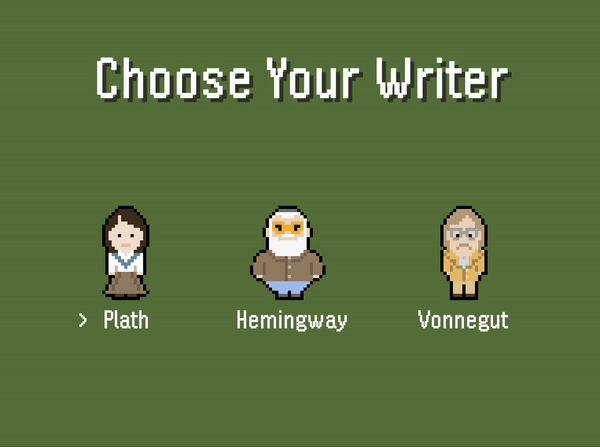

<h1 style="text-align:center;">Walden</h1>

 
<h2>About</h2>

A 32-bit treasure hunt adventure featuring heroes of the literary world, made with Java and Java Swing.

This project was primarily developed during my undergraduate studies to strengthen my understanding of Java Swing. As I advanced, I found more problems I wanted to figure out how to solve, leading to an expansion of the project's scope. This culminated in the creation of, ultimately, a pretty silly game that features custom tilemaps, sprites, and a unique soundtrack. Through this experience, I gained valuable insights into game design and development, while also enjoying the creative journey.

<h2>Gameplay</h2>

Explore Henry David Thoreau’s famed property as your favorite author on an 
adventure to help find a missing manuscript.

Run into the troubled ghost of Thoreau in the woods

Pick up coffee for a speed boost

Or alcohol, but beware of the side effects.

Pick up all the pages and return to Thoreau's cabin to reveal his "lost" manuscript.

